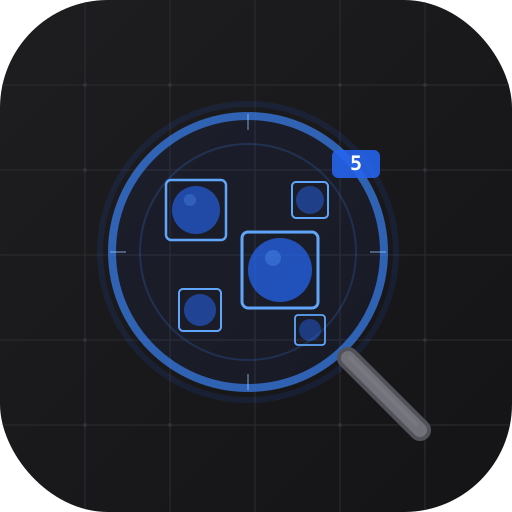
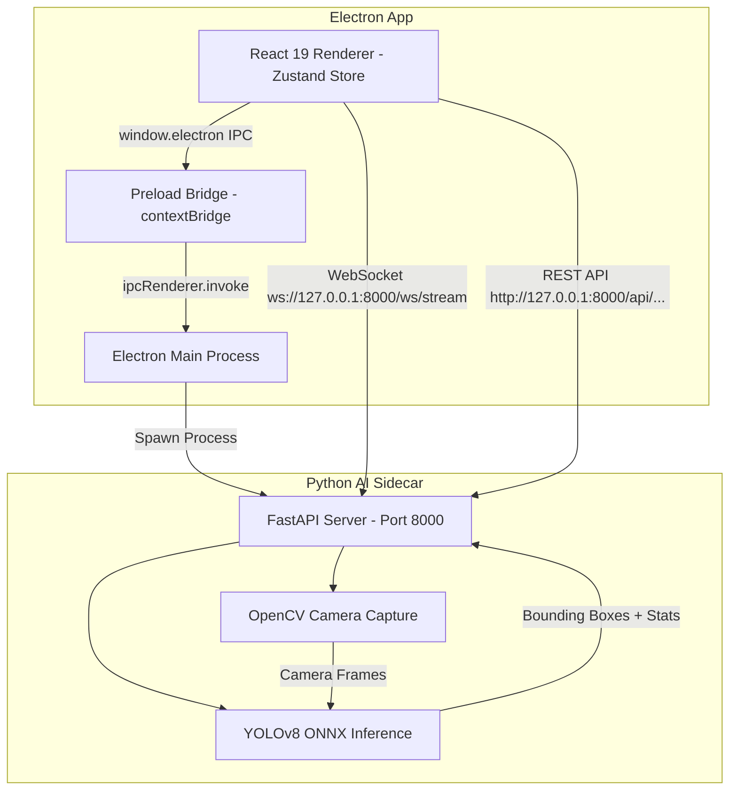

# DropDetect AI — ระบบวิเคราะห์ขนาดละอองสารเคมีด้วย AI

<div align="center">
  
</div>

<div align="center">


**แอปพลิเคชันเดสก์ท็อปสำหรับวิเคราะห์ขนาดหยดละอองสารเคมีกำจัดยุงลาย ผ่านกล้องจุลทรรศน์แบบเรียลไทม์ด้วย YOLOv8 AI สำหรับ ศูนย์ควบคุมโรคติดต่อนำโดยแมลงที่ 12.2 สงขลา**

</div>

---

## 📖 สารบัญ (Table of Contents)
1. [ภาพรวมของโปรเจกต์ (Overview)](#1-ภาพรวมของโปรเจกต์-overview)
2. [คุณสมบัติหลักของระบบ (Features)](#2-คุณสมบัติหลักของระบบ-features)
3. [ภาพหน้าจอตัวอย่าง (Screenshots)](#3-ภาพหน้าจอตัวอย่าง-screenshots)
4. [เทคโนโลยีที่เลือกใช้ (Tech Stack)](#4-เทคโนโลยีที่เลือกใช้-tech-stack)
5. [โครงสร้างและสถาปัตยกรรมระบบ (Architecture)](#5-โครงสร้างและสถาปัตยกรรมระบบ-architecture)
6. [เริ่มต้นใช้งานสำหรับนักพัฒนา (Getting Started)](#6-เริ่มต้นใช้งานสำหรับนักพัฒนา-getting-started)
7. [การติดตั้งสำหรับผู้ใช้งานทั่วไป (Installation)](#7-การติดตั้งสำหรับผู้ใช้งานทั่วไป-installation)
8. [ตัวอย่างการใช้งาน (Usage)](#8-ตัวอย่างการใช้งาน-usage)
9. [การรองรับหลายภาษา (Internationalization)](#9-การรองรับหลายภาษา-internationalization)
10. [แนวทางการพัฒนาและส่งมอบงาน (Contributing)](#10-แนวทางการพัฒนาและส่งมอบงาน-contributing)
11. [สัญญาอนุญาตการใช้งาน (License)](#11-สัญญาอนุญาตการใช้งาน-license)

---

## 1. ภาพรวมของโปรเจกต์ (Overview)

DropDetect AI เป็นแอปพลิเคชันเดสก์ท็อปสำหรับ **วิเคราะห์ขนาดหยดละอองสารเคมีกำจัดยุงลาย** (Droplet Size Analysis) ที่ใช้ปัญญาประดิษฐ์ YOLOv8 ในการตรวจจับและวัดขนาดหยดละอองจากภาพกล้องจุลทรรศน์ USB แบบเรียลไทม์

โดยปกติ การประเมินคุณภาพการพ่นสารเคมีกำจัดยุงลายต้องอาศัยผู้เชี่ยวชาญนับและวัดขนาดหยดละอองบนสไลด์แก้วด้วยตาเปล่าผ่านกล้องจุลทรรศน์ ซึ่งใช้เวลานานและมีโอกาสผิดพลาดสูง DropDetect AI ถูกออกแบบมาเพื่อ **ทดแทนกระบวนการนับมือ** ด้วยระบบ AI อัตโนมัติที่ตรวจจับ นับ วัดขนาด และวิเคราะห์ค่าสถิติ VMD (Volume Median Diameter) ตามมาตรฐาน WHO ทั้งหมดภายในไม่กี่วินาที

---

## 2. คุณสมบัติหลักของระบบ (Features)

*   **🔬 ตรวจจับละอองเรียลไทม์ (Live AI Detection):** เชื่อมต่อกล้องจุลทรรศน์ USB โดยตรง ระบบ YOLOv8 + ByteTrack จะตรวจจับ ติดตาม และนับหยดละอองแบบเรียลไทม์พร้อม Bounding Box สีสัน
*   **📊 สถิติครบถ้วนตามมาตรฐาน WHO:** คำนวณค่า VMD (Dv0.5), Span, Dv0.1, Dv0.9, อัตราหยดนอกขอบเขต (Out-of-Bounds), และแสดงผลการตรวจสอบมาตรฐาน WHO Compliance (Pass/Fail) ทันที
*   **🖼️ นำเข้าภาพและวิดีโอ (Import Media):** รองรับการลากไฟล์ภาพ/วิดีโอมาวาง (Drag & Drop) เพื่อวิเคราะห์โดยไม่ต้องต่อกล้อง
*   **📸 ระบบสไลด์และ Snapshot:** ถ่ายภาพ Snapshot เก็บสะสมข้อมูลหยดละอองแยกตามสไลด์ ทดลองใหม่ (Retake) ได้ตามต้องการ
*   **✏️ แก้ไขด้วยมือ (Manual Edit):** เพิ่ม ลบ หรือแก้ไขขนาดหยดละอองด้วยมือ รองรับทั้งเครื่องมือวาดวงกลม สี่เหลี่ยม จุด และยางลบ
*   **📁 บันทึกและเปิดโปรเจกต์ (.drop):** บันทึกข้อมูลเป็นไฟล์ `.drop` (ZIP) เปิดทำงานต่อได้ทุกเมื่อ พร้อม Auto-Save ทุก 30 วินาที
*   **📥 ส่งออกรายงาน Excel:** Export ผลวิเคราะห์เป็นไฟล์ Excel (`.xlsx`) รองรับทั้งรูปแบบภาษาไทยและอังกฤษ ตามแบบฟอร์มมาตรฐานของกรมควบคุมโรค
*   **🌐 รองรับ 2 ภาษา (TH/EN):** สลับภาษาของ UI ทั้งโปรแกรมได้ทันทีผ่านหน้า Settings
*   **🔧 ปรับขนาดหน้าจอ (Scale & Layout):** ขยาย/ย่อขนาดของ UI ได้ตามความเหมาะสมของจอแสดงผล

---

## 3. ภาพหน้าจอตัวอย่าง (Screenshots)

<div align="center">
  
  <p><em>ระบบตรวจจับหยดละอองแบบเรียลไทม์ผ่านกล้องจุลทรรศน์</em></p>
</div>

<div align="center">
  
  <p><em>แถบสถิติ VMD, Span, WHO Compliance แสดงผลแบบเรียลไทม์</em></p>
</div>

---

## 4. เทคโนโลยีที่เลือกใช้ (Tech Stack)

| ส่วน | เทคโนโลยี |
| :--- | :--- |
| **แอปพลิเคชันเดสก์ท็อป** | Electron v34, electron-vite v5 |
| **หน้าตาผู้ใช้ (Frontend)** | React 19, Zustand (State Management), Tailwind CSS v4, Lucide React Icons |
| **ระบบ AI ตรวจจับ (Backend)** | Python 3.10+, FastAPI, OpenCV, ONNXRuntime (YOLOv8 Nano) |
| **การสื่อสาร** | WebSocket (Real-time Video Stream), REST API (File Operations) |
| **โมเดล AI** | YOLOv8n Custom-trained (`.onnx`) สำหรับเลนส์ 4x และ 10x |
| **เว็บไซต์โปรดักท์** | React + Vite + Tailwind CSS (Bilingual TH/EN) |

---

## 5. โครงสร้างและสถาปัตยกรรมระบบ (Architecture)



**โครงสร้างไฟล์หลัก:**
```
app-ai-12-2-tuari/
├── electron/              # Electron Main + Preload
│   ├── main.ts            # Window lifecycle, IPC, Python spawn
│   └── preload.ts         # Secure contextBridge API
├── src/                   # React Frontend
│   ├── components/        # UI Components (Sidebar, Dashboard, Workspace, Settings)
│   ├── layouts/           # AppLayout with Loading Screen
│   ├── store/             # Zustand global state (useAppStore.ts)
│   ├── i18n.ts            # Bilingual TH/EN translations
│   └── main.tsx           # React entry point
├── backend/               # Python AI Backend
│   └── main.py            # FastAPI + YOLOv8 + OpenCV + WebSocket
├── fileonnx/              # ONNX AI Models (4x & 10x)
├── resources/             # Lens calibration configs (JSON)
├── website/               # Product landing page (React + Vite)
└── electron-builder.json5 # Build config (Windows NSIS + Linux AppImage/deb/rpm)
```

---

## 6. เริ่มต้นใช้งานสำหรับนักพัฒนา (Getting Started)

### ข้อกำหนดเบื้องต้น (Prerequisites)
*   **Node.js:** เวอร์ชัน 18 หรือสูงกว่า
*   **Python:** เวอร์ชัน 3.10 หรือสูงกว่า
*   **กล้องจุลทรรศน์ USB** (สำหรับโหมดกล้องสด)

### ขั้นตอนการรันระบบบนเครื่องตัวเอง (Local Development)

1. **คัดลอกโปรเจกต์ลงเครื่อง:**
   ```bash
   git clone https://github.com/Han-tkp/app-ai-12-2-tuari.git
   cd app-ai-12-2-tuari
   ```

2. **ติดตั้ง Dependencies (Node.js):**
   ```bash
   npm install
   ```

3. **ติดตั้ง Dependencies (Python Backend):**
   ```bash
   cd backend
   python -m venv venv
   # Windows:
   venv\Scripts\activate
   # Linux/Mac:
   source venv/bin/activate

   pip install -r requirements.txt
   cd ..
   ```

4. **เริ่มรันโหมดพัฒนา (Development Mode):**
   ```bash
   npm run dev
   ```
   *ระบบจะเปิดหน้าต่าง Electron พร้อม Dev Server และเริ่ม Python AI Backend อัตโนมัติ*

5. **Build สำหรับใช้งานจริง (Production):**
   ```bash
   # Windows (.exe installer)
   npm run build

   # Linux (.AppImage + .deb)
   npx electron-vite build && npx electron-builder --linux AppImage deb
   ```

---

## 7. การติดตั้งสำหรับผู้ใช้งานทั่วไป (Installation)

ดาวน์โหลดตัวติดตั้งจากหน้า [GitHub Releases](https://github.com/Han-tkp/app-ai-12-2-tuari/releases):

| แพลตฟอร์ม | ไฟล์ | หมายเหตุ |
| :--- | :--- | :--- |
| 🪟 **Windows 10/11 (x64)** | `DropDetect-AI-Setup-x.x.x.exe` | ตัวติดตั้ง NSIS พร้อม Shortcut |
| 🐧 **Ubuntu / Debian** | `DropDetect-AI-x.x.x.deb` | ติดตั้งด้วย `sudo dpkg -i *.deb` |
| 🐧 **Linux Universal** | `DropDetect-AI-x.x.x.AppImage` | คลิกรันได้เลย ไม่ต้องติดตั้ง |
| 🎩 **Fedora / RHEL** | `DropDetect-AI-x.x.x.rpm` | ติดตั้งด้วย `sudo rpm -i *.rpm` |

---

## 8. ตัวอย่างการใช้งาน (Usage)

### โหมดกล้องสด (Live Camera Mode)
1. ต่อกล้องจุลทรรศน์ USB เข้ากับคอมพิวเตอร์
2. เปิดแอป → กด **"สร้างโปรเจกต์กล้องสด"** → เลือกเลนส์ (4x หรือ 10x)
3. กดเปิดกล้อง → เปิด Live AI → ระบบจะตรวจจับหยดละอองอัตโนมัติ
4. กด **"ถ่ายภาพ (Snapshot)"** เพื่อเก็บข้อมูลสะสมลงสไลด์
5. ส่งออกผลวิเคราะห์เป็นไฟล์ Excel ได้ทันที

### โหมดนำเข้าสื่อ (Import Media Mode)
1. เปิดแอป → กด **"สร้างโปรเจกต์จากสื่อ"**
2. ลากไฟล์ภาพหรือวิดีโอมาวางบนหน้าจอ (Drag & Drop)
3. ระบบจะวิเคราะห์และแสดงผลหยดละอองที่ตรวจพบ

---

## 9. การรองรับหลายภาษา (Internationalization)

DropDetect AI รองรับ **2 ภาษา** ได้แก่:
- 🇹🇭 **ภาษาไทย** (Default สำหรับผู้ใช้งานหลัก)
- 🇬🇧 **English** (สำหรับผู้ใช้งานที่ถนัดภาษาอังกฤษ)

สลับภาษาได้ที่ **Settings → Appearance & Output → Language**
ทุก Layout, ปุ่ม, เมนู และหน่วยวัดจะเปลี่ยนตามภาษาที่เลือกทันที

---

## 10. แนวทางการพัฒนาและส่งมอบงาน (Contributing)

หากต้องการร่วมพัฒนาหรือปรับปรุงระบบ:
1. ทำการ **Fork** โปรเจกต์นี้ไปยัง Repository ส่วนตัวของคุณ
2. สร้าง Feature Branch: `git checkout -b feature/amazing-feature`
3. Commit การแก้ไข: `git commit -m "feat: add new analysis mode"`
4. Push ขึ้น Branch: `git push origin feature/amazing-feature`
5. เปิด **Pull Request** เข้ามาที่สาขาหลัก (`main`)

---

## 11. สัญญาอนุญาตการใช้งาน (License)

โปรเจกต์นี้เผยแพร่ภายใต้สิทธิ์ **MIT License** อนุญาตให้ใช้งาน ปรับปรุง และเผยแพร่เพื่อการศึกษาและการปฏิบัติงานของศูนย์ควบคุมโรคติดต่อนำโดยแมลงที่ 12.2 สงขลา

---

<div align="center">

**พัฒนาโดย ศูนย์ควบคุมโรคติดต่อนำโดยแมลงที่ 12.2 สงขลา**

*Developed for DDC 12.2 Songkhla — Bureau of Vector Borne Disease, Department of Disease Control, Thailand*

</div>
